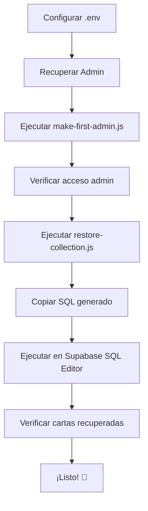

# Guía de Recuperación: Acceso Admin y Colección de Cartas

Esta guía te ayudará a recuperar tu acceso de administrador y las cartas de tu colección que desaparecieron.

## 📋 Índice

1. [Requisitos Previos](#requisitos-previos)
2. [Recuperar Acceso de Administrador](#recuperar-acceso-de-administrador)
3. [Recuperar Cartas de Colección](#recuperar-cartas-de-colección)
4. [Verificación](#verificación)
5. [Solución de Problemas](#solución-de-problemas)

---

## 🔧 Requisitos Previos

### 1. Configurar Variables de Entorno

Necesitas obtener tus credenciales de Supabase:

1. Ve a tu proyecto en [Supabase Dashboard](https://app.supabase.com)
2. Navega a **Settings → API**
3. Copia las siguientes credenciales:
   - **Project URL** → `SUPABASE_URL`
   - **anon/public key** → `SUPABASE_ANON_KEY`
   - **service_role key** (secret) → `SUPABASE_SERVICE_ROLE_KEY`

### 2. Actualizar el archivo `.env`

Edita el archivo `.env` en la raíz del proyecto con tus credenciales:

```env
SUPABASE_URL=https://tu-proyecto.supabase.co
SUPABASE_ANON_KEY=eyJhbGciOiJIUzI1NiIsInR5cCI6IkpXVCJ9...
SUPABASE_SERVICE_ROLE_KEY=eyJhbGciOiJIUzI1NiIsInR5cCI6IkpXVCJ9...
```

⚠️ **IMPORTANTE**: El `service_role` key es secreto y tiene acceso completo a tu base de datos. Nunca lo compartas ni lo subas a Git.

---

## 👤 Recuperar Acceso de Administrador

### Opción 1: Usando el Script (Recomendado)

El proyecto incluye un script automatizado para restaurar privilegios de admin:

```bash
# Especificar tu email
node scripts/make-first-admin.js tu-email@ejemplo.com

# O editar el script para cambiar el email por defecto
npm run admin:make-first
```

**Salida esperada:**

```
🔧 Making first admin...
📧 Target email: tu-email@ejemplo.com

🔍 Searching for user...
✓ Found user: tu-email@ejemplo.com
  User ID: abc123...
  Created: 2024-01-01...

🔍 Checking admin status...
⚡ Granting admin privileges...

✅ SUCCESS!
🎉 tu-email@ejemplo.com is now an admin!

The user can now:
  - View all users and their collections
  - See system statistics
  - Grant/revoke admin privileges to other users
  - Access admin panel in the UI
```

### Opción 2: Manualmente con SQL

Si prefieres hacerlo manualmente, ejecuta este SQL en el **Supabase SQL Editor**:

```sql
-- 1. Encuentra el UUID del usuario
SELECT id, email FROM auth.users WHERE email = 'tu-email@ejemplo.com';

-- 2. Copia el UUID del paso anterior y úsalo aquí
INSERT INTO admins (user_id, granted_by)
VALUES ('UUID-del-paso-1', NULL);
```

---

## 📦 Recuperar Cartas de Colección

### ¿Por qué desaparecieron mis cartas?

Durante la migración del esquema de base de datos, las cartas originales fueron movidas a una tabla de respaldo llamada `cards_backup_old_schema` para:

1. Evitar duplicación de datos
2. Normalizar el almacenamiento
3. Mejorar el rendimiento

**No se perdieron** - están en la tabla de backup y se pueden recuperar.

### Paso 1: Ejecutar el Script de Recuperación

```bash
# Especificar tu email
node scripts/restore-collection.js tu-email@ejemplo.com

# O editar el script para cambiar el email por defecto
npm run restore:collection
```

Este script generará el **SQL necesario** para recuperar tus cartas.

### Paso 2: Copiar y Ejecutar el SQL Generado

El script mostrará un bloque de SQL como este:

```sql
-- 1. Verificar cuántas cartas hay en el backup para el usuario
SELECT COUNT(*) as total_cards
FROM cards_backup_old_schema
WHERE user_id = 'tu-user-id';

-- 2. Ver las primeras 5 cartas del backup
SELECT card_data->>'name' as card_name, created_at
FROM cards_backup_old_schema
WHERE user_id = 'tu-user-id'
ORDER BY created_at DESC
LIMIT 5;

-- 3. RECUPERAR TODAS LAS CARTAS DEL BACKUP
DO $$
DECLARE
    cards_restored INTEGER := 0;
    new_cards INTEGER := 0;
BEGIN
    -- Insertar cartas únicas en master_cards
    INSERT INTO master_cards (id, name, card_data, created_at)
    SELECT DISTINCT ON (card_data->>'id')
        card_data->>'id' AS id,
        card_data->>'name' AS name,
        card_data,
        MIN(created_at) AS created_at
    FROM cards_backup_old_schema
    WHERE user_id = 'tu-user-id'
      AND card_data->>'id' IS NOT NULL
    GROUP BY card_data->>'id', card_data->>'name', card_data
    ON CONFLICT (id) DO NOTHING;

    GET DIAGNOSTICS new_cards = ROW_COUNT;

    -- Insertar relaciones en user_collections
    INSERT INTO user_collections (user_id, card_id, added_at)
    SELECT
        user_id,
        card_data->>'id' AS card_id,
        created_at
    FROM cards_backup_old_schema
    WHERE user_id = 'tu-user-id'
      AND card_data->>'id' IS NOT NULL
    ON CONFLICT (user_id, card_id) DO NOTHING;

    GET DIAGNOSTICS cards_restored = ROW_COUNT;

    -- Inicializar límites si no existen
    INSERT INTO user_limits (user_id, max_cards)
    VALUES ('tu-user-id', 500)
    ON CONFLICT (user_id) DO NOTHING;

    RAISE NOTICE '===== RECUPERACIÓN COMPLETADA =====';
    RAISE NOTICE 'Cartas únicas añadidas a master_cards: %', new_cards;
    RAISE NOTICE 'Cartas restauradas a tu colección: %', cards_restored;
    RAISE NOTICE '================================';
END $$;

-- 4. Verificar la recuperación
SELECT COUNT(*) as total_cards_in_collection
FROM user_collections
WHERE user_id = 'tu-user-id';
```

### Paso 3: Ejecutar en Supabase

1. Ve a tu proyecto en [Supabase Dashboard](https://app.supabase.com)
2. Abre **SQL Editor**
3. Crea una nueva consulta
4. Pega el SQL generado por el script
5. Ejecuta (Run)
6. Verifica los mensajes de **NOTICE** que mostrarán cuántas cartas se recuperaron

---

## ✅ Verificación

### Verificar Acceso Admin

1. Inicia sesión en la aplicación con tu cuenta
2. Deberías ver el panel de administración
3. Prueba acceder a `/api/admin/check`:

```bash
curl -H "Authorization: Bearer tu-token" http://localhost:3000/api/admin/check
```

Respuesta esperada:
```json
{
  "isAdmin": true,
  "userId": "abc123...",
  "email": "tu-email@ejemplo.com"
}
```

### Verificar Cartas Recuperadas

En la aplicación, ve a tu colección y verifica que tus cartas estén visibles.

O consulta la API:

```bash
curl -H "Authorization: Bearer tu-token" http://localhost:3000/api/collection
```

---

## 🔍 Solución de Problemas

### Error: "Missing required environment variables"

**Problema**: No se encontró el archivo `.env` o faltan credenciales.

**Solución**:
1. Verifica que el archivo `.env` existe en la raíz del proyecto
2. Asegúrate de que todas las variables estén configuradas correctamente
3. Reinicia el servidor después de modificar `.env`

### Error: "User not found"

**Problema**: El email no está registrado en Supabase.

**Solución**:
1. Verifica que te hayas registrado en la aplicación
2. Confirma que el email sea correcto
3. Revisa los usuarios disponibles listados en el error

### Error: "relation 'admins' does not exist"

**Problema**: La tabla `admins` no se ha creado en la base de datos.

**Solución**:
1. Ve a Supabase SQL Editor
2. Ejecuta el script `supabase-schema.sql` completo
3. Intenta nuevamente

### Error: "relation 'cards_backup_old_schema' does not exist"

**Problema**: No se ejecutó la migración o las cartas nunca existieron.

**Solución**:
1. Verifica si hay datos en la tabla `cards` original:
   ```sql
   SELECT COUNT(*) FROM cards;
   ```
2. Si hay datos, ejecuta la migración:
   ```bash
   # Ejecuta la migración desde SQL Editor
   # Usa: migrations/001_normalize_and_add_limits_FIXED.sql
   ```
3. Si no hay datos, es posible que las cartas no se hayan guardado originalmente

### No se recuperan cartas después de ejecutar el SQL

**Posibles causas**:
1. El `user_id` no coincide con tus cartas en el backup
2. Las cartas tienen `card_data->>'id'` NULL

**Solución de diagnóstico**:
```sql
-- Verificar cartas en backup para todos los usuarios
SELECT user_id, COUNT(*) as total
FROM cards_backup_old_schema
GROUP BY user_id;

-- Ver cartas sin ID (problemáticas)
SELECT COUNT(*) as cards_without_id
FROM cards_backup_old_schema
WHERE card_data->>'id' IS NULL;

-- Si hay cartas sin ID, necesitarás un script especial
```

---

## 📞 Soporte Adicional

Si después de seguir todos los pasos aún tienes problemas:

1. Revisa los logs del servidor
2. Verifica la consola del navegador para errores de autenticación
3. Consulta los archivos de documentación:
   - `ADMIN.md` - Guía completa de administración
   - `ARCHITECTURE.md` - Documentación del sistema de base de datos
   - `MIGRATION_GUIDE.md` - Detalles sobre las migraciones

---

## 📝 Resumen del Proceso



---

**Última actualización**: 2025-11-17
